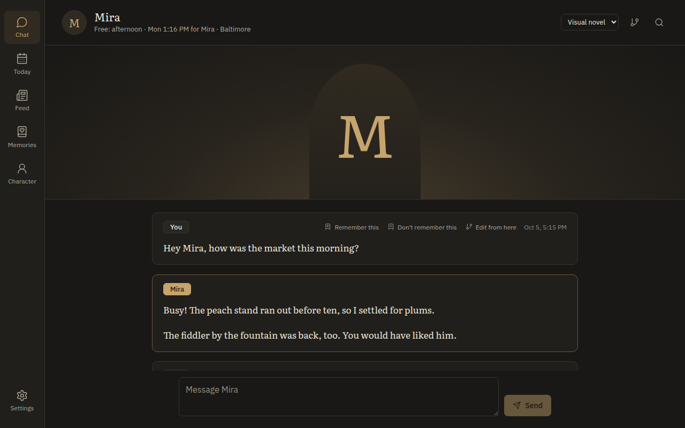
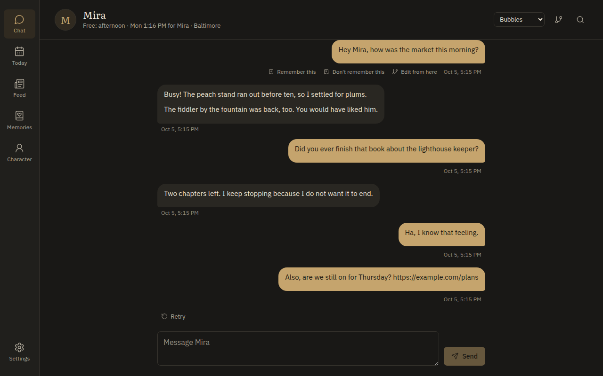
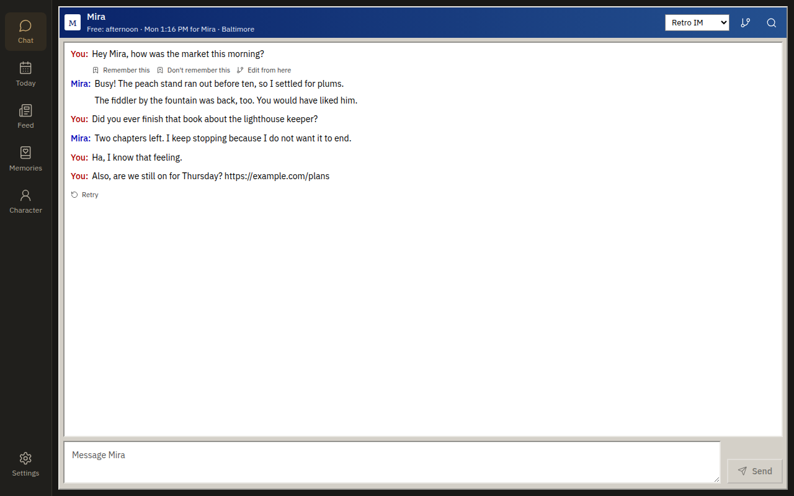
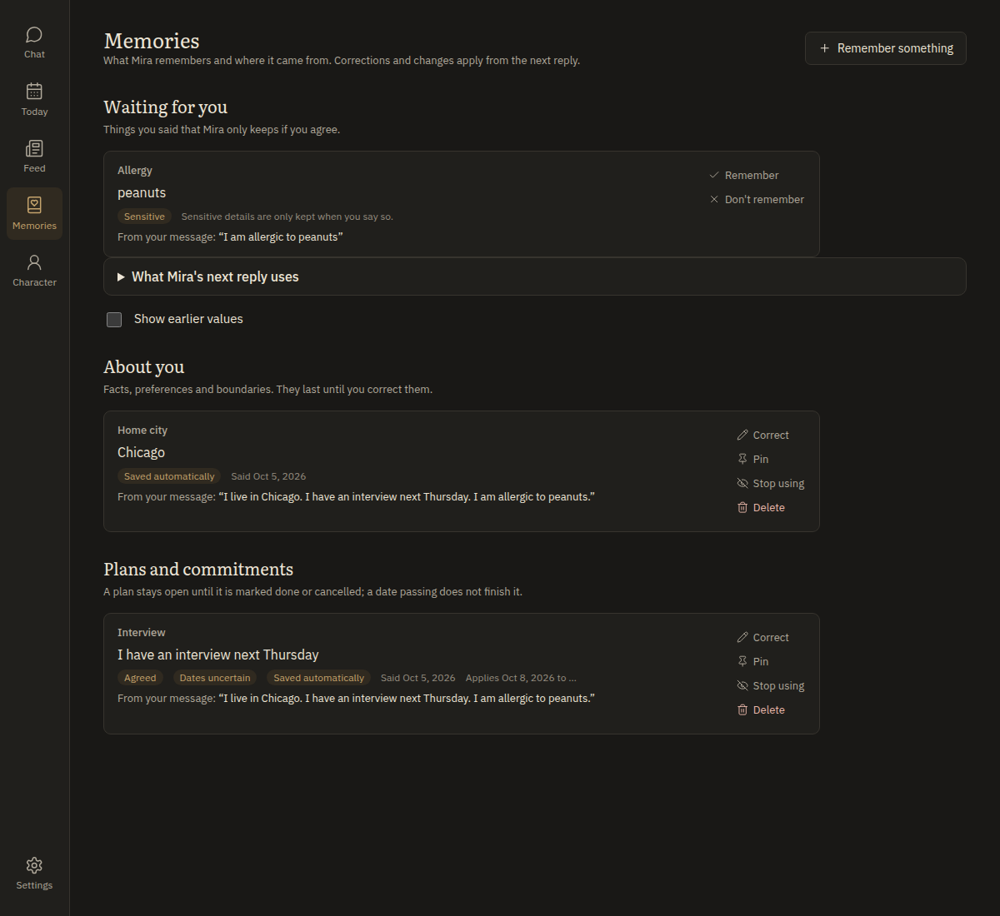
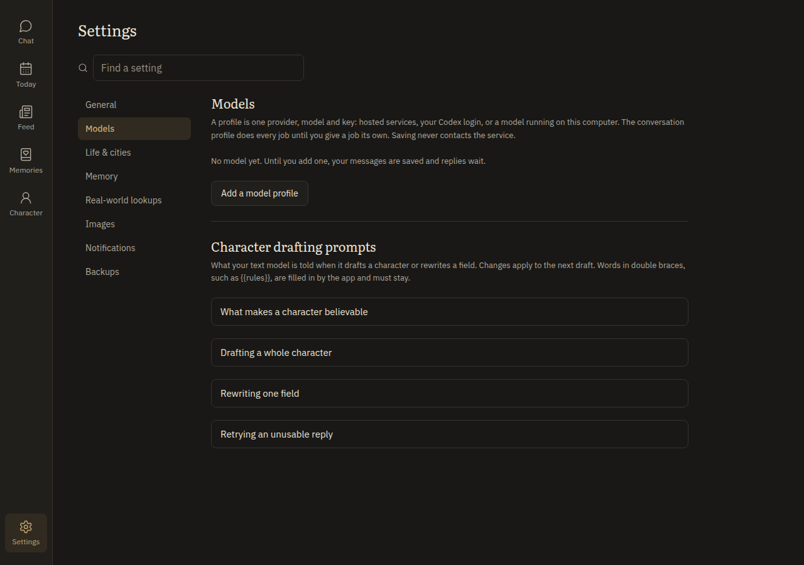

  

  
  
  
  

# Prospero's Companion

**A companion who lives real days in a real city, with friends, plans and news to share. Private, on your own PC.**

Most chat companions only exist while you're talking to them. Prospero's Companion is the opposite of a Tamagotchi: you don't keep them alive, they keep living. They go to work, run errands, see friends, get colds, overspend before payday and come back with stories. When you open the app, what happened while you were away is already there.

It runs on your computer and talks to whichever model you choose: a hosted API (OpenAI, Anthropic, Google, OpenRouter, any OpenAI-compatible service, your Codex login) or a local model through LM Studio, Kobold or any OpenAI-compatible server. Friendship is the default relationship; you can build something else.

It comes from the maker of [Prospero's Study](https://github.com/vantaloomin/prosperos-study) and reuses its foundations.

> **This is an early beta.** It works end to end on Windows, and the Mac scripts pass CI but haven't been tried on a real Mac yet. See [Known issues](#known-issues).

## What it does

  

**A life of their own.** Your companion follows a weekly routine in their city, with a hidden week-ahead plan for them and everyone they know. Plans made in chat actually happen. Weather, holidays, birthdays, money, a home that slowly changes, and a body that gets tired or sick all carry over from day to day. Events are built from data and templates on your PC; the model only puts them into words, so it stays quick and cheap.

**People around them.** Family (who share their last name), friends, coworkers, friends of friends and ordinary townsfolk they meet on their street. Storylines play out with a drama slider from realistic to soap opera. A private Feed shows their posts and their friends', with likes and comments. You can even make someone they met the main character.

**They text first.** Check-ins on their breaks, follow-ups on things they said they'd ask about, news and photos, within daily limits and quiet hours. The app never shows whether they're free: a busy companion answers later, or sends a quick "can't talk" and replies properly afterward.

**They stay in character.** No "as an AI" disclaimers. Start a message with `OOC:` or wrap it in ((double parentheses)) when you want a plain answer.

**Memory you control.** Facts you mention are remembered automatically (you can turn this off), and the Memories page shows exactly what the next reply will use. Correct, pin, exclude or delete anything. Conflicts are asked about rather than overwritten.

**Pictures.** Selfies, photos of what they're doing, views and memes, through the Codex CLI, a local ComfyUI or a hosted image API. Every request is classified on your PC first: NSFW only goes to a local ComfyUI, and prohibited content is refused everywhere.

**Cities.** Built-in real cities (Baltimore, New York, Miami, San Diego, Las Vegas), public-domain ones (Victorian London, Camelot, Oz) and originals (steampunk Calderwick, frontier Whitlock). Build your own, including fantasy settings with their own currency. Cities change month to month as places open and close.

**The real world, if you want it.** Weather where you both live, holidays and sports seasons, and optional built-in lookups for local headlines, scores, movies, TV and music, so they can bring up what's actually going on.

**Yours to shape.** Guided character creation from a one-line idea, a full character editor, opt-in emotional edges (jealousy, guilt, reacting to your absence), five chat styles, timelines that branch from any message, a model per job, backups and restore, and phone access over your own Tailscale network.

<table>
  <tr>
    <td width="50%"></td>
    <td width="50%"></td>
  </tr>
  <tr>
    <td></td>
    <td></td>
  </tr>
</table>

## Getting started

### Windows

The quickest way is the installer: download `ProsperoCompanion-<version>-win-x64-setup.exe` from the [latest release](https://github.com/vantaloomin/prosperos-companion/releases/latest) and run it. It needs no administrator rights, Python or Node, and adds Prospero Companion to the Start menu. It isn't code-signed yet, so SmartScreen may ask you to click **More info**, then **Run anyway**.

To run from the source instead:

1. Install [Git](https://git-scm.com/download/win) and clone this repository, or download the source code ZIP from the latest release and unzip it.
2. Open the `Windows` folder and double-click **`install.bat`**. It finds or installs Python 3.12+ and Node.js 22.13+, installs the locked dependencies and builds the interface.
3. Double-click **`launch.bat`**. The Companion opens in your browser at http://127.0.0.1:8775. Keep its window open while you use it.
4. Add a model in **Settings > Models**, then create your companion.

Later, `update.bat` pulls the newest version (Git clones only) and `create-shortcut.bat` puts a shortcut on your desktop.

### Mac

Clone the repository (or download the ZIP), open the `Mac` folder and double-click **`install.command`**, then **`launch.command`**. The scripts are unsigned, so a downloaded ZIP needs one **Open Anyway** the first time. [Installing on a Mac](Program/docs/macos.md) walks through it.

### Linux

There are no helper scripts yet; [Development](Program/docs/development.md) shows how to run it from the `Program` folder.

Your companion's data never lives in the program folder, so updating or re-downloading keeps it. It is in `%LOCALAPPDATA%\ProsperoCompanion` on Windows and `~/Library/Application Support/ProsperoCompanion` on a Mac.

## Which folder is for you

| Folder | Who it is for |
| --- | --- |
| [`Windows`](Windows) | Running the Companion on a Windows PC. |
| [`Mac`](Mac) | Running it on a Mac. |
| [`Program`](Program) | The app itself: code, interface, tests, build scripts and docs. You never need to open it to use the Companion. |

| Script | What it does |
| --- | --- |
| `install.bat` | Finds or installs Python 3.12+ and Node.js 22.13+, installs the locked dependencies and builds the interface. Run once, and again after changing dependencies. |
| `launch.bat` | Starts the Companion on http://127.0.0.1:8775 and opens it in the browser. Keep its window open; close it to stop. |
| `update.bat` | Pulls the latest `main` and reruns the install. Close the Companion first. |
| `status.bat` | Says whether the Companion is running, and on which address. |
| `stop.bat` | Stops a running Companion, for when its window is lost. Never stops another program on the port. |
| `create-shortcut.bat` | Puts a Prospero Companion shortcut to `launch.bat` on the desktop. |
| `dev.bat` | Development mode: the backend reloads on Python changes and Vite serves http://127.0.0.1:5175 with live interface updates. |

Each script has a Mac twin in `Mac` with the same name ending in `.command`.

## Privacy

The Companion only listens on your own computer (127.0.0.1); phone access goes through your own Tailscale network, never the open internet. Conversations, memories and pictures stay in your data folder. The only things that leave your PC are requests to the model and image services you set up, and lookups you switch on, each of which asks before it shares anything. API keys are kept in your operating system's credential store and never written to logs.

## Known issues

- **Not code-signed.** Windows SmartScreen may warn about the installer or scripts ("More info", then "Run anyway"), and macOS Gatekeeper blocks the first run of a downloaded ZIP.
- **Mac is untested on real hardware.** The scripts and tests pass on GitHub's Apple Silicon and Intel Macs. Please report anything that behaves differently.
- **Not yet tried on real setups:** phone access over Tailscale, and the Local Pulse and Culture Pulse lookups (tested only against recorded responses).
- **Image generation** depends on your own backend. The built-in Krea 2 Turbo workflow for ComfyUI has been run on an RTX 5090; the first picture waits while ComfyUI loads the model (a few minutes), and text inside pictures usually comes out garbled.
- **Real-city data** (rents, prices, neighborhoods) comes from general knowledge and is labeled as estimates.

Found a bug? [Open an issue](https://github.com/vantaloomin/prosperos-companion/issues).

## Documentation

- [Models](Program/docs/models.md)
- [Character drafting](Program/docs/character-drafting.md)
- [Image generation](Program/docs/images.md)
- [World data and building cities](Program/docs/world-data.md)
- [Current context tools (MCP)](Program/docs/context-tools.md)
- [Phone access](Program/docs/phone-access.md)
- [Importing from Prospero's Study](Program/docs/study-import.md)
- [Installing on a Mac](Program/docs/macos.md)
- [Development](Program/docs/development.md)
- [Backbone architecture](Program/docs/architecture.md)
- [Life simulation API](Program/docs/life-api.md)
- [Product requirements (draft)](Program/docs/product-requirements.md)
- [Acceptance status](Program/docs/acceptance-status.md)
- [Changelog](CHANGELOG.md)

## License

Licensed under the [GNU Affero General Public License v3.0](LICENSE), matching the Prospero's Study code it reuses.
